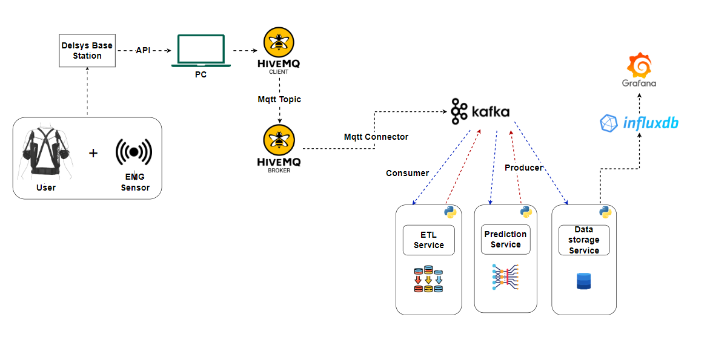

# Real-Time Muscle Stress Prediction for Shoulder Supported Exoskeleton Interaction

## Introduction
The primary objective of this project is to develop an application that utilizes a deep learning model to accurately predict real-time stress caused in a muscle. This application will be seamlessly integrated into a digital platform specifically crafted to evaluate the performance of shoulder-supported exoskeleton interaction. By leveraging advanced deep learning techniques, the system aims to provide precise and real-time insights into muscle stress, which is crucial for optimizing the performance and safety of exoskeletons used in various industrial and medical applications.

## Project Overview
The project involves the following key components:

* **Data Collection**: Gathering muscle stress data using sensors and integrating it into a structured dataset.
* **Data Preprocessing**: Cleaning and preparing the data for training by normalizing features and segmenting time-series data.
* **Model Development**: Designing and training a deep learning model (LSTM) to predict muscle stress based on the preprocessed data.
* **Real-Time Prediction**: Implementing the trained model in a real-time environment to provide continuous stress predictions.
* **Platform Integration**: Integrating the predictive model into a digital platform for real-time monitoring and performance evaluation of shoulder-supported exoskeletons.


## Table of Contents
1.  [Introduction](#introduction)
2.  [Overview](#Overview)
3.  [Scope](#Scope)
4.  [Objectives](#Objectives)
5.  [LSTM_Model_Overview](#LSTM_Model_Overview)
6.  [Architecture_Diagram](#Architecture_Diagram)
7.  [Installation](#Installation)
8.  [Usage](#Usage)
9.  [Features](#Features)
10.  [Testing](#Testing)
11.  [Contributing](#Contributing)
12. [License](#License)
13. [Acknowledgements](#Acknowledgements)

## Scope
The scope of this project includes the development and integration of a real-time muscle stress prediction model into a comprehensive digital platform designed for exoskeleton performance evaluation.

## Key Objectives
* **Accurate Stress Prediction:** Develop a deep learning model capable of accurately predicting muscle stress in real-time.
* **Real-Time Integration:** Ensure the model can operate in a real-time environment for continuous monitoring.
* **Platform Development:** Integrate the model into a digital platform to assess exoskeleton performance.
* **User-Friendly Interface:** Create an intuitive interface for easy interaction with the prediction system.

## LSTM Model Overview
The Long Short-Term Memory (LSTM) model is a type of recurrent neural network (RNN) that is particularly effective for learning from sequences of data. In this project, the LSTM model is used to predict muscle stress by analyzing time-series data collected from sensors. The model consists of an LSTM layer followed by dense layers that process the output and produce the final predictions. This architecture allows the model to capture temporal dependencies and patterns in the data, leading to accurate real-time predictions.

## Architecture Diagram


## Installation

### Steps
Clone the repository: 
```
git clone git@github.com:Vikneshwara-kumar/DL-Based-Muscle-Strain-Prediction-System.git
```

Navigate to the project directory: 
```
cd DL-Based-Muscle-Strain-Prediction-System
```

To set up the environment and install dependencies, use the provided setup_environment.sh script:
```
chmod +x setup_environment.sh
./setup_environment.sh
```

## Usage 
### Model Training
1.  **Prepare the Data:** Ensure your dataset is available in the Dataset/Train.csv file.
2.  **Run the Main Script:** Execute the main script to start the training process.
```
python main.py
```
3.  **Results:** After the training is complete, the following files will be saved in the results directory:
*   training_validation_loss.png: Plot of training and validation loss over epochs.
*   confusion_matrix.png: Heatmap of the confusion matrix.
*   lstm_model.keras: Trained LSTM model.
*   scaler.pkl: Scaler used for data preprocessing.

### Model Deployement
####    Build and Run the Docker Container,Navigate to the project directory: 
```
cd DL-Based-Muscle-Strain-Prediction-System/Inference
```
In your terminal, navigate to your project directory and run the following command to build the Docker image:
```
docker build -t muscle-stress-prediction .
```
####    Run the Docker Container:

Use the following command to run the Docker container, providing the necessary environment variables:
```
docker run -e KAFKA_BROKER='192.168.50.234:29093' -e NORMALIZED_DATA_TOPIC='extracted_features' -e PREDICTION_TOPIC='predictions' -p 5001:5001 muscle-stress-prediction
```

## Features
*   Data Preprocessing: Scales and segments time-series data for model training.
*   LSTM Model: Deep learning model for predicting muscle stress.
*   Training and Evaluation: Includes training the model and evaluating its performance on test data.
*   Result Visualization: Generates plots for training loss and confusion matrix.

## Testing
To test the individual components:

1.  Unit Tests: Write unit tests for each function to ensure they work correctly.
2.  Integration Tests: Test the integration of the preprocessing steps and model training.

##  Contributing
Contributions are welcome! Please follow these steps:

1.  Fork the repository.
2.  Create your feature branch (git checkout -b feature/YourFeature).
3.  Commit your changes (git commit -m 'Add some feature').
4.  Push to the branch (git push origin feature/YourFeature).
5.  Open a pull request.

## License
This project is licensed under the MIT License. See the LICENSE file for details.

##  Acknowledgements
Special thanks to the research community for providing insights and resources.